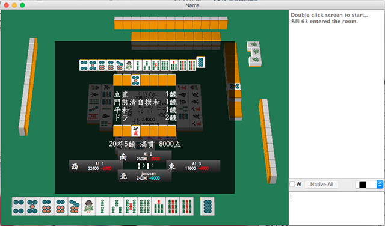
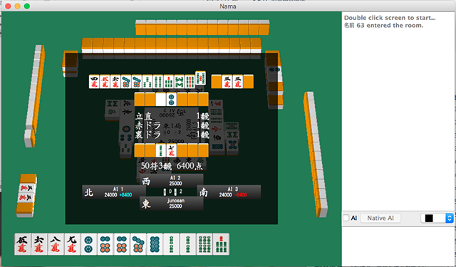

## Nama

*Nama* is a Japanese Riichi Mahjong server/client based on Qt/OpenGL.
Notable features include network play with a built-in chat server and
AI as a plugin which can be toggled on/off for all four players.
This can be used to let different AI algorithms compete with each other
or just be played against for fun.

## Notes

- Requires Qt 5 for building (developed on Qt 5.3)
- Tested on macOS and Windows (haven't tested on Linux, but likely to work
  with very minor or no modifications)
- Compiled binaries can be found in
  [releases page](https://github.com/junosan/Nama/releases)

## Screenshots

- Network chat (supports basic HTML for formatting)

- Playing against 3 AIs; prompt for Riichi

- Tsumo finish

- Ron finish

- Lots of Kans

- Reached Ryuukyoku during a Furiten

- Score board for a full Hanchan

- A nice 5-way Tenpai

- If no one is over 30000 points, game continues to the West wind

